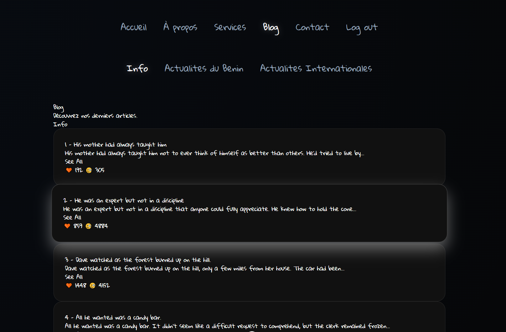

# 🚀 Vue.js Auth System

Ce projet est une application web développée avec **Vue.js 3 (Composition API)**. Elle intègre un système complet d'authentification (Sign Up / Sign In) avec une gestion rigoureuse de la sécurité via les **Navigation Guards** de Vue Router.

---

## 🛠️ Fonctionnalités

### 🔐 Authentification & Sécurité

* **Inscription (Sign Up)** : Création de compte utilisateur avec validation des données et stockage dans le `localStorage`.
* **Connexion (Sign In)** : Vérification des identifiants et redirection automatique.
* **Protection des Routes (Auth Guard)** :
* Interdiction d'accéder aux pages privées sans être connecté.
* Redirection automatique vers l'accueil si un utilisateur connecté tente d'accéder aux pages `SignIn` ou `SignUp` via l'URL.


* **Persistence** : Session utilisateur maintenue après actualisation de la page.

### 🎨 Expérience Utilisateur

* **Feedback Visuel** : Animation de secousse (*shake animation*) sur le formulaire en cas d'erreur de connexion.
* **Navigation Dynamique** : La barre de navigation est masquée sur les pages d'authentification et n'apparaît qu'une fois connecté.

---

## 📸 Aperçu de l’interface



---

## 🏗️ Structure du Projet

```text
src/
 ├── assets/          # Fichiers CSS et images
 ├── components/      # Composants réutilisables (Navigation, etc.)
 ├── services/        # Logique métier (authService.js)
 ├── views/           # Pages de l'application (Home, SignIn, SignUp)
 ├── router/          # Configuration et sécurité des routes
 └── App.vue          # Composant racine

```

---

## 🚀 Installation et Lancement

1. **Cloner le projet** :
```bash
git clone https://github.com/Calebdami/Projet_Gestion_des_blogs_Vue_JS.git
cd votre-repo

```


2. **Installer les dépendances** :
```bash
npm install

```


3. **Lancer en mode développement** :
```bash
npm run dev
---

## 💡 Technologies utilisées

* **Vue 3** : Framework JavaScript (Script Setup).
* **Vue Router** : Gestion de la navigation.
* **LocalStorage** : Stockage des données côté client pour simuler une base de données.
* **CSS3** : Animations personnalisées pour les erreurs de saisie.

---
